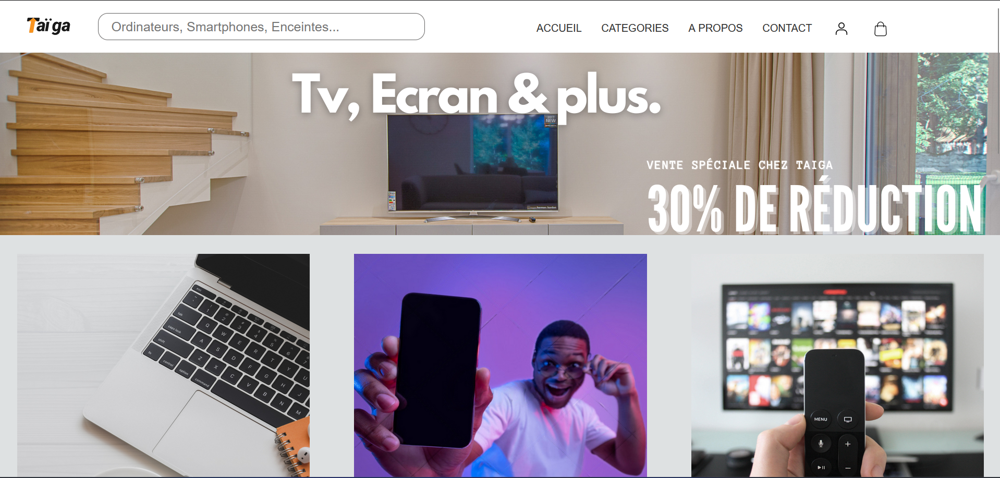

<h1>Taiga E-commerce Website</h1>

Taiga is an E-commerce site focused on high-tech products. As a customer, you can view the products offered using the search bar or the category page on the home page.

<h1>User section</h1>
<h2 align="center">Home Page</h2>

You can search any products or go to the category section.

<h2 align="center">Page Smartphone Catgeory</h2>

Here is an example of a category page showing smartphones. On its left, the function filters that allows to search in detail the desired product, by price and by category. You can change the category if you want directly in this page.

<h2 align="center">Search Bar</h2>

If we type "laptop" on the search bar, we can see the differents laptop shown, with the button "Add to cart" in french

<h2 align="center">Single page product</h2>

Single page laptop, with id in the url to show the product you want

<h2 align="center">Cart page</h2>

Cart page, you can change the quantity and the price increase or descrease, we can also delete the product if you don't want to or pay and have your command number

<h1>Admin section</h1>

<h2 align="center">Admin Page</h2>

On the left, we can see the message if someone contact us, on the right, all the command with the id of the user and the total price.

<h2 align="center">User Management</h2>

User management, we can edit the names, the mail, and set if the user is an admin or not.

<h2 align="center">Product Management</h2>

Product Management, we can edit the price product, the title, the description...etc

<h3>Thanks to <a href="https://github.com/Ewilanstr">@Ewilanstr</a></h3>
